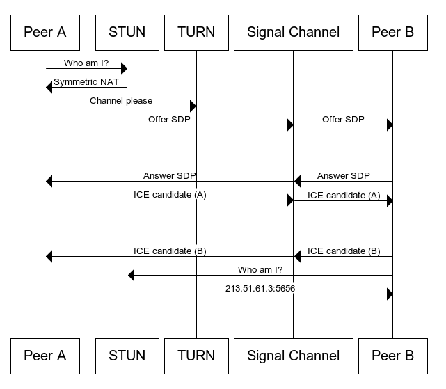

# webrtc-demo
Playing around with WebRTC

This diagram from the WebRTC docs closely resembles what this application
is doing. This application does not use a TURN server, so there's a chance
two clients will be unable to connect. I'm currently using Google's public
STUN servers which are for development. So far seems to work fine when the two
clients are on the same network.



Stack:
- NodeJs
  - Express
  - Express-Ws (Websockets)
- Vanilla HTML/CSS/JS
  - Bootstrap
  - Websockets

## Setup
```shell
yarn install
yarn run start
```

## Connecting clients
1. Load the webpage
2. Toggle video on
3. One peer should initiate a session by sending an offer
4. The other peer should answer the offer
5. Finally, the original peer can add the candidate to the session
   - Video + audio = janky version of Google Meet
   - Also, you can join from two different tabs

## Docker image build on M1/M2 Mac
```shell
# Push to microk8s registry
docker buildx build --platform linux/amd64,linux/arm64 --push -t home-server:32000/local/web-rtc-demo .
```
